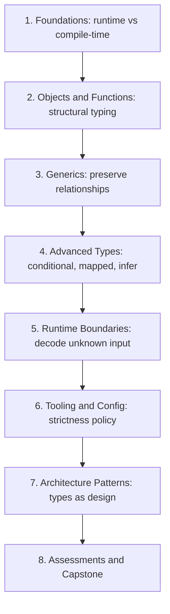

# TypeScript Mastery Roadmap

This course is now organized as 8 complete phases.

> Each phase builds on the one before it. Do them in order the first time through.

## Phase 1: Foundations

Focus:

- runtime vs compile-time mental model
- `any` / `unknown` / `never`
- narrowing and exhaustiveness

Deliverables:

- lesson, gotchas, exercises, solutions, conceptual questions, assignment

## Phase 2: Objects and Functions

Focus:

- structural typing
- function contract design
- excess property checks and readonly boundaries

Deliverables:

- lesson, gotchas, exercises, solutions, conceptual questions, assignment

## Phase 3: Generics

Focus:

- preserving type relationships
- constraints, `keyof`, inference-friendly APIs
- avoiding generic over-engineering

Deliverables:

- lesson, gotchas, exercises, solutions, conceptual questions, assignment

## Phase 4: Advanced Types

Focus:

- conditional/mapped/template literal types
- `infer` extraction patterns
- utility composition and real-world type transforms

Deliverables:

- lesson, gotchas, exercises, solutions, conceptual questions, assignment

## Phase 5: Runtime Boundaries

Focus:

- unknown input decoding
- DTO -> domain mapping
- typed boundary error design

Deliverables:

- lesson, gotchas, exercises, solutions, conceptual questions, assignment

## Phase 6: Tooling and Config

Focus:

- strictness policy
- module resolution reasoning
- CI quality gates and migration plans

Deliverables:

- lesson, gotchas, exercises, solutions, conceptual questions, assignment

## Phase 7: Architecture Patterns

Focus:

- discriminated workflow modeling
- ports/adapters and anti-corruption layers
- explicit result contracts in services

Deliverables:

- lesson, gotchas, exercises, solutions, conceptual questions, assignment

## Phase 8: Assessments and Capstone

Focus:

- checkpoint mastery per module
- integrated end-to-end capstone

Deliverables:

- `assessments/module-checkpoints.md`
- `assessments/final-capstone.md`

## Course Rule

For every feature, ask:

1. What JavaScript will run?
2. What assumptions is TypeScript checking before runtime?
3. Where can runtime boundaries still fail?