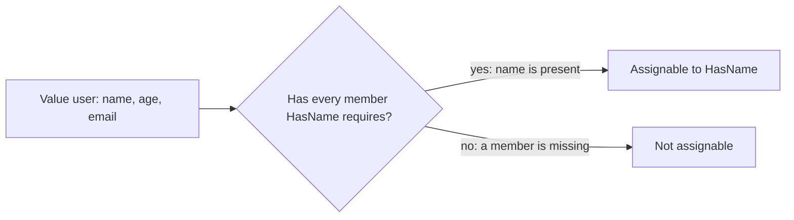

# Module 2: Objects and Functions

## The Big Picture

TypeScript enforces **structural compatibility**, not **nominal identity**.

In Java or C#:
```java
// Nominal typing: names must match
class Dog extends Animal { }
Dog d = new Dog();
Animal a = d;  // Works because Dog extends Animal
```

In TypeScript:
```ts
// Structural typing: shapes must match
type Animal = { name: string; move(): void };
type Dog = { name: string; move(): void };

const dog: Dog = { name: "Rex", move() { } };
const animal: Animal = dog;  // Works because shapes match
```

**TypeScript does not care about names. Only about shapes.**

This changes how you design functions, objects, and systems.



> Assignability flows one way: a value may have extra members, but it must have every member the target requires.

---

## Part 1: Structural Typing Fundamentals

### Why Structural Typing?

**Problem it solves**: You don't need to plan inheritance hierarchies in advance.

```ts
// No inheritance hierarchy declared
type HasName = { name: string };
type HasAge = { age: number };

// But I can use them anywhere:
function greet(person: HasName) {
  console.log(`Hello, ${person.name}`);
}

const user = { name: "Sonik", age: 24, email: "test@example.com" };
greet(user);  // Works! User has { name: string }, which is all greet needs.
```

Without structural typing, you would need:

```ts
// Nominal approach (more work):
interface IPerson {
  name: string;
}

class User implements IPerson {
  constructor(public name: string) {}
}

const user = new User("Sonik");
greet(user);  // Only works if User explicitly implements IPerson
```

**Structural typing = more flexibility. Less upfront planning.**

### Compatibility Rules

An object is compatible with a type if it has **at least** those properties with compatible types.

```ts
type User = { id: string; name: string };

// All of these work:
const user1: User = { id: "1", name: "Sonik" };                                 // exact match
const user2: User = { id: "1", name: "Sonik", email: "test@example.com" };      // extra properties OK
const user3: User = { id: "1", name: "Sonik", email: "test@example.com", age: 24 }; // more extras OK
```

**But this does NOT work:**

```ts
const user4: User = { id: "1" };  // ERROR: missing 'name'
const user5: User = { id: 1, name: "Sonik" };  // ERROR: id is number, not string
```

**Key insight**: Structural typing checks that the **required properties exist** and have **correct types**. Extra properties are fine.

---

## Part 2: Objects in Detail

### Excess Property Checks

Here is something surprising:

```ts
type User = { id: string; name: string };

// This works:
const db = { id: "1", name: "Sonik", email: "test@example.com" };
const user: User = db;  // No error!

// But this does NOT work:
const user2: User = { id: "1", name: "Sonik", email: "test@example.com" };  // ERROR!
```

**Why the difference?**

TypeScript assumes **object literals** (right side of assignment) might be typos.

```ts
// Likely typo: meant to just pass User
const result = someFunction({ id: "1", name: "Sonik", extraField: true });
```

But **assigned objects** (from variables) are assumed intentional:

```ts
const fullData = { id: "1", name: "Sonik", email: "test@example.com" };
// You clearly meant to include email—TypeScript trusts it
const user: User = fullData;
```

**Excess property check** only applies to **fresh object literals**.

### Optional vs. Extra

```ts
type User = { id: string; name: string; email?: string };

// These both work:
const user1: User = { id: "1", name: "Sonik" };           // email omitted (optional)
const user2: User = { id: "1", name: "Sonik", email: "test@example.com" }; // email provided
```

But:

```ts
type StrictUser = { id: string; name: string };

const user3: StrictUser = { id: "1", name: "Sonik", email: "x" };  // ERROR: excess property 'email'
```

**Pattern**: Use `?` for "might be here", but don't accept extra unplanned properties.

### Index Signatures

Sometimes you need to accept arbitrary properties:

```ts
type FlexibleObject = {
  id: string;           // known property
  [key: string]: any;   // unknown properties
};

const obj: FlexibleObject = {
  id: "1",
  email: "test@example.com",
  phone: "555-1234",
  unknownField: true
};  // All OK
```

**But this is unsafe:**

```ts
type FlexibleObject = {
  id: string;
  [key: string]: any;
};

const obj: FlexibleObject = { id: "1" };
obj.anythingGoes;  // TypeScript allows this, but what if it's undefined?
```

**Use index signatures only when you really need flexibility.**

### Readonly Properties

Promises: "I won't change this."

```ts
type ReadonlyUser = {
  readonly id: string;
  readonly name: string;
};

const user: ReadonlyUser = { id: "1", name: "Sonik" };
user.name = "Keshav";  // ERROR: Cannot assign to readonly property
```

**Readonly is a TypeScript-only guarantee.** At runtime, nothing stops reassignment.

```ts
type ReadonlyUser = { readonly id: string };
const user: ReadonlyUser = { id: "1" };

(user as any).id = "2";  // Runtime allows it, TypeScript does not
```

**Use readonly:**
- For configuration objects (should not change)
- For API responses (immutability contract)
- For props in React (parent controls, child should not modify)

---

## Part 3: Function Contracts

### Weak vs. Strong Contracts

**Weak contract** (accept anything, interpret at runtime):

```ts
function update(id: string, field: string, value: unknown): void {
  // Hope the caller passes valid field/value combination
  // But TypeScript cannot check this
}

update("user1", "age", "not a number");  // Oops! Compiles but wrong.
```

**Strong contract** (encode intent in types):

```ts
function updateAge(id: string, age: number): void {
  // TypeScript ensures age is a number
}

updateAge("user1", "not a number");  // ERROR: argument must be number
```

**Why strong is better**:
1. **Type safety**: Impossible states at compile time
2. **Self-documenting**: Function name + types tell the story
3. **IDE support**: Better autocomplete and refactoring

### Generic Constraints with `keyof`

A balanced approach: generic but type-safe.

```ts
type User = {
  id: string;
  name: string;
  age: number;
};

// Weak: field can be anything
function updateUserWeak(id: string, field: string, value: unknown): void {
  // ...
}

// Strong but repetitive:
function updateId(id: string, newId: string) { }
function updateName(id: string, name: string) { }
function updateAge(id: string, age: number) { }

// Balanced with keyof:
function updateUser<K extends keyof User>(
  id: string,
  field: K,
  value: User[K]  // Type of value must match type of field
): void {
  // Implementation
}

// Usage:
updateUser("u1", "age", 30);          // OK: age is number
updateUser("u1", "age", "30");        // ERROR: must be number
updateUser("u1", "unknownField", 30); // ERROR: unknownField not in User
```

**This is the sweet spot:**
- Field must be a key in User
- Value must match the type of that field
- Type-safe AND flexible

---

## Part 4: Function Parameter Design

### Parameter Objects vs. Multiple Parameters

**Multiple parameters:**

```ts
function createUser(name: string, email: string, age: number, isPublic: boolean): void {
  // Hard to remember order
}

createUser("Sonik", "test@example.com", 24, true);   // OK, but unclear
createUser("Sonik", true, 24, "test@example.com");   // Compiles! But wrong order!
```

**Parameter object:**

```ts
type UserInput = {
  name: string;
  email: string;
  age: number;
  isPublic: boolean;
};

function createUser(input: UserInput): void {
  // Clear which field is which
}

createUser({ name: "Sonik", email: "test@example.com", age: 24, isPublic: true });
createUser({ name: "Sonik", isPublic: true, age: 24, email: "test@example.com" }); // Same, order doesn't matter
```

**Parameter objects win when:**
- More than 2 parameters
- Parameters might grow in the future
- Parameters are conceptually related

### Discriminated Unions for Operations

Express "only these combinations are valid":

```ts
type Operation =
  | { type: "rename"; id: string; newName: string }
  | { type: "changeEmail"; id: string; newEmail: string }
  | { type: "setAge"; id: string; age: number };

function applyOperation(op: Operation): void {
  if (op.type === "rename") {
    console.log(`Rename ${op.id} to ${op.newName}`);
  } else if (op.type === "changeEmail") {
    console.log(`Change email to ${op.newEmail}`);
  } else if (op.type === "setAge") {
    console.log(`Set age to ${op.age}`);
  }
}

// These work:
applyOperation({ type: "rename", id: "u1", newName: "Keshav" });
applyOperation({ type: "changeEmail", id: "u1", newEmail: "new@example.com" });

// This does NOT work (good!):
applyOperation({ type: "rename", id: "u1", newEmail: "x" });  // ERROR: can't mix fields
```

---

## Part 5: Compatibility Rules and the Surprising Bits

### Function Parameter Bias

Functions are compatible in **reverse** for parameters:

```ts
type Handler = (x: number) => void;

// This is OK:
const handler: Handler = (x: number | string) => {
  // Handler accepts number | string
};

// But Handler promises to call with just number!
// So Handler(5) works fine.
```

This is called **contravariance**. It's intentional and correct.

### Object Property Assignment

```ts
type Base = { id: string };
type Extended = { id: string; name: string };

const base: Base = { id: "1" };
const extended: Extended = { id: "1", name: "Sonik" };

base = extended;  // OK: extended has all of base's properties
extended = base;  // ERROR: missing 'name'
```

### Readonly Variations

```ts
type Mutable = { value: string };
type Immutable = { readonly value: string };

const mut: Mutable = { value: "x" };
const immu: Immutable = mut;  // OK: immutable can use mutable source

// But:
const immu2: Immutable = { value: "x" };
const mut2: Mutable = immu2;  // ERROR: lost readonly protection!
```

---

## Common Patterns in Production

### Configuration Objects

```ts
type DatabaseConfig = {
  host: string;
  port: number;
  username: string;
  password: string;
  readonly ssl: boolean;  // Cannot change after creation
  readonly retries?: number;  // Optional but readonly
};

function connectDatabase(config: DatabaseConfig): void {
  // ...
}

// User provides config, TypeScript ensures all required fields
connectDatabase({
  host: "localhost",
  port: 5432,
  username: "admin",
  password: "secret",
  ssl: true
});
```

### Plugin Systems

```ts
type Plugin = {
  name: string;
  version: string;
  hooks: {
    onInit?: () => void;
    onDestroy?: () => void;
  };
};

function registerPlugin(plugin: Plugin): void {
  // Accepts any object with this shape
}

// Different objects, same shape:
registerPlugin({
  name: "auth",
  version: "1.0",
  hooks: { onInit: () => console.log("Auth started") }
});

registerPlugin({
  name: "logging",
  version: "2.0",
  hooks: { onDestroy: () => console.log("Logging stopped") }
});
```

### Data Transformation

```ts
type Transformer<T> = {
  input: T;
  transform: (value: T) => T;
  readonly readonly: boolean;
};

// Generic but type-safe:
function pipeline<T>(transformers: Transformer<T>[]): void {
  // Apply each transformer
}
```

---

## Key Takeaways

1. **Structural typing** means TypeScript cares about shape, not names
2. **Excess property checks** only apply to object literals, not variables
3. **Weak contracts** (generic strings) are less safe than **strong contracts** (specific types)
4. **keyof + indexed access** provides balance between flexibility and safety
5. **Parameter objects** beat multiple parameters for clarity
6. **Readonly** prevents accidental mutation
7. **Discriminated unions** encode valid combinations
8. Functions use **contravariance**: they're compatible when they accept MORE than promised

## What NOT To Do

- Don't use weak contracts (`field: string, value: unknown`) unless you have runtime constraints
- Don't ignore excess property checks—they catch typos
- Don't use index signatures everywhere—they lose type safety
- Don't mutate objects unless the type explicitly allows it