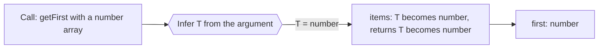

# Module 3: Generics

## The Problem Generics Solve

Without generics, type information gets lost.

```ts
// Information loss problem
function getFirst(items: unknown[]): unknown {
  return items[0];  // Return type is unknown
}

const numbers = [1, 2, 3];
const first = getFirst(numbers);  // first is unknown, not number

// You lose the relationship: "if input is number[], output is number"
```

With generics, the relationship is preserved:

```ts
function getFirst<T>(items: T[]): T {
  return items[0];  // Return type is T
}

const numbers = [1, 2, 3];
const first = getFirst(numbers);  // first is number
```

TypeScript inferred `T = number` from the argument. Now the output type is connected to the input type.

## Key Mental Model

Think of generics as **slots for types**.

- `T` is a slot. It stands in for any type.
- When you call a generic function, TypeScript fills that slot based on what you pass.
- The function works the same way for every type, but respects each type's rules.



> The type slot T is filled in at the call site, then flows through the whole signature.

## Part 1: Basic Generics

### Single Type Parameter

```ts
// Generic function: T is a placeholder for any type
function identity<T>(value: T): T {
  return value;
}

identity(42);        // T = number, returns number
identity("hello");   // T = string, returns string
identity(true);      // T = boolean, returns boolean
```

The same function works for all types, but each call respects the type.

### Arrays and Collections

```ts
function getLength<T>(items: T[]): number {
  return items.length;  // Same for any array
}

// All return number
getLength([1, 2, 3]);
getLength(["a", "b"]);
getLength([true, false, true]);
```

### Generic Types, Not Just Functions

```ts
// Generic type: reusable shape with a slot
type Container<T> = {
  value: T;
  isEmpty: boolean;
};

const numberBox: Container<number> = { value: 42, isEmpty: false };
const stringBox: Container<string> = { value: "hello", isEmpty: false };

// You fill the slot when using the type
```

## Part 2: Constraints

Not every function can work on every type. Constraints say what a generic must be capable of.

```ts
// Unconstrained (too loose)
function getProperty<T>(obj: T, key: string): unknown {
  return (obj as any)[key];  // Has to lie to TypeScript
}

// Constrained (type-safe)
function getProperty<T extends Record<string, unknown>>(
  obj: T,
  key: string
): unknown {
  return obj[key];  // obj must be an object with string keys
}

getProperty({ name: "Sonik" }, "name");  // OK
getProperty(42, "anything");             // ERROR: number is not assignable
```

**Common constraints:**

```ts
// Must be an object
<T extends object>

// Must have a specific property
<T extends { id: string }>

// Must be a string or number
<T extends string | number>

// Must be a specific class
<T extends Error>
```

## Part 3: Multiple Type Parameters

```ts
// Two slots for two types
function merge<T, U>(first: T, second: U): T & U {
  return { ...first, ...second } as T & U;
}

merge({ name: "Sonik" }, { age: 24 });
// Result type: { name: string } & { age: number }
```

## Part 4: The `keyof` Operator

`keyof` lets you work with property names safely.

```ts
type User = { id: string; name: string; email: string };

// Without keyof: unsafe
function getUserProperty(user: User, key: string): unknown {
  return (user as any)[key];  // Lying to TypeScript
}

// With keyof: safe
function getUserProperty<K extends keyof User>(user: User, key: K): User[K] {
  return user[key];  // TypeScript knows key is valid
}

getUserProperty(user, "name");     // OK, returns string
getUserProperty(user, "unknown");  // ERROR: "unknown" is not a valid key
```

The relationship: input key → output type.

## Part 5: Type Inference

TypeScript is smart about inferring generic types.

```ts
// Explicit (verbose)
getFirst<number>([1, 2, 3]);

// Inferred (better, TypeScript figures it out)
getFirst([1, 2, 3]);  // TypeScript knows T = number
```

**Good APIs let the caller not think about generics.**

```ts
// Bad: caller must specify types
function map<T, U>(items: T[], mapper: (item: T) => U): U[] {
  return items.map(mapper);
}
const result = map<number, string>([1, 2], n => n.toString());

// Good: inference handles it
const result = map([1, 2], n => n.toString());  // T and U inferred
```

## Part 6: Default Type Parameters

```ts
// If you do not specify T, it defaults to string
type Container<T = string> = {
  value: T;
};

const c1: Container = { value: "hello" };           // T = string (default)
const c2: Container<number> = { value: 42 };       // T = number (explicit)
```

## Part 7: Conditional Types (Preview)

You can have logic in types.

```ts
// If T is a string, return boolean; otherwise return T
type StringOrElse<T> = T extends string ? boolean : T;

type A = StringOrElse<string>;  // boolean
type B = StringOrElse<number>;  // number
```

We will dive deep into conditional types in Module 4.

## Common Patterns

### Pattern 1: Preserve Input-Output Relationship

```ts
// input array type → output element type
function first<T>(items: T[]): T | undefined {
  return items[0];
}
```

### Pattern 2: Extract Properties Safely

```ts
function pick<T, K extends keyof T>(obj: T, key: K): T[K] {
  return obj[key];
}
```

### Pattern 3: Transform Collections

```ts
function map<T, U>(items: T[], fn: (item: T) => U): U[] {
  return items.map(fn);
}
```

### Pattern 4: Constrain to Common Properties

```ts
function merge<T extends object, U extends object>(first: T, second: U): T & U {
  return { ...first, ...second } as T & U;
}
```

## When NOT To Use Generics

Generics add complexity. Only use them when:

1. **The same logic works for multiple types** — not just one type
2. **Information loss would hurt** — output relates to input
3. **The caller benefits** — easier to read, less `any`, better errors

**Bad use of generics:**

```ts
// This does not need to be generic. It is specific to strings.
function stringLength<T extends string>(value: T): number {
  return value.length;
}

// Just write:
function stringLength(value: string): number {
  return value.length;
}
```

## What To Practice

- Write generic functions with clear input/output relationships.
- Add constraints only when the function needs them.
- Use `keyof` to access properties safely.
- Build APIs that infer types instead of forcing explicit types.
- Know when a generic is over-engineered.

## Key Questions To Ask

For every generic you write, ask:

1. Does this function work the same way for every type?
2. Is there a real relationship between input and output types?
3. Would removing the generic make the code less safe?
4. Will the caller understand what the generic means?

If the answer to any is "no," you might not need a generic.