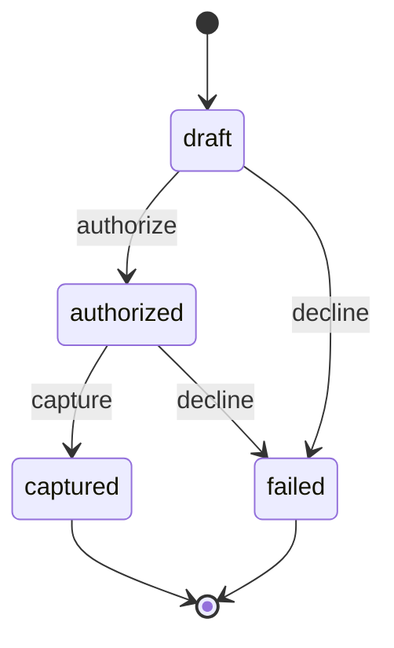
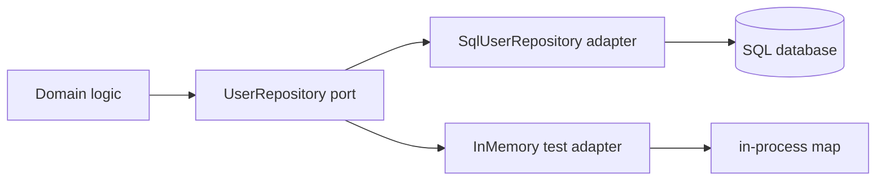

# Module 7: Architecture Patterns

## Why This Module Exists

At this stage, syntax is not the bottleneck.

The real challenge is designing code so types enforce architecture decisions.

Great TypeScript architecture makes invalid states hard to represent and easy to detect.

## Core Mental Model

Types are executable design constraints.

Use them to define boundaries:

- who owns state transitions
- who may call external systems
- where runtime validation must occur
- what a function guarantees on success/failure

## Pattern 1: Workflow As Discriminated Union

Model states precisely:

```ts
type PaymentState =
	| { kind: "draft" }
	| { kind: "authorized"; authId: string }
	| { kind: "captured"; captureId: string }
	| { kind: "failed"; reason: string };
```

Now transitions can be guarded by function signatures instead of comments. A
transition function can only accept the states it is allowed to start from, so
illegal moves (like capturing a payment that was never authorized) do not
compile:

```ts
// Only an authorized payment can be captured.
function capture(
  payment: Extract<PaymentState, { kind: "authorized" }>,
  captureId: string
): Extract<PaymentState, { kind: "captured" }> {
  return { kind: "captured", captureId };
}

declare const state: PaymentState;

if (state.kind === "authorized") {
  const captured = capture(state, "cap_123"); // OK: narrowed to authorized
}

// capture({ kind: "draft" }, "cap_123");
// ERROR: 'draft' is not assignable to the 'authorized' parameter.
```

The compiler now enforces the state machine. Comments describing "valid
transitions" are replaced by signatures the compiler actually checks.



> Each arrow is a transition function whose parameter type only accepts the states it is allowed to start from. Illegal arrows do not compile.

## Pattern 2: Ports and Adapters

Define internal contracts first (ports), then external integration (adapters).

```ts
type UserRepository = {
	findById(id: string): Promise<User | null>;
	save(user: User): Promise<void>;
};
```

Domain logic depends on this contract, not on ORM or HTTP details. An adapter
implements the port using whatever technology the outside world requires:

```ts
type User = { id: string; email: string };

// Adapter: the only place that knows about database rows.
class SqlUserRepository implements UserRepository {
  constructor(
    private readonly db: { query(sql: string, params: unknown[]): Promise<unknown[]> }
  ) {}

  async findById(id: string): Promise<User | null> {
    const rows = await this.db.query("SELECT id, email FROM users WHERE id = ?", [id]);
    const row = rows[0] as { id: string; email: string } | undefined;
    return row ? { id: row.id, email: row.email } : null;
  }

  async save(user: User): Promise<void> {
    await this.db.query("INSERT INTO users (id, email) VALUES (?, ?)", [user.id, user.email]);
  }
}
```

Swap `SqlUserRepository` for an in-memory fake in tests, and the domain code
never notices. That is the payoff of depending on the port, not the adapter.



> Domain logic points at the port in the middle. Adapters plug in from the outside, so infrastructure can change without touching the core.

## Pattern 3: Command/Query Separation

Make side effects and reads explicit.

- commands mutate state and return result objects
- queries read projections and return read models

```ts
// Command: changes state, returns an outcome (not the data).
type CreateOrder = (input: { userId: string; total: number }) => Promise<{ orderId: string }>;

// Query: reads state, returns a read model, never mutates.
type GetOrderSummary = (orderId: string) => Promise<{
  orderId: string;
  total: number;
  status: string;
}>;
```

Keeping the two shapes separate means a reviewer can tell, from the type alone,
whether a function is safe to call twice. Reads are repeatable; commands are not.

This reduces accidental coupling and hidden side effects.

## Pattern 4: Result Types Instead Of Ambiguous Throws

Prefer explicit result envelopes at service boundaries:

```ts
type ServiceResult<T, E> =
	| { ok: true; value: T }
	| { ok: false; error: E };
```

This improves composition and observability. Because the result is a value, the
caller must handle both branches — there is no invisible `throw` to forget:

```ts
declare const repo: UserRepository;

async function loadUser(id: string): Promise<ServiceResult<User, "not-found">> {
  const user = await repo.findById(id);
  return user ? { ok: true, value: user } : { ok: false, error: "not-found" };
}

const result = await loadUser("u1");
if (result.ok) {
  console.log(result.value.email); // narrowed to User
} else {
  console.log(result.error);       // narrowed to "not-found"
}
```

## Pattern 5: Anti-Corruption Layer For Third-Party APIs

Never leak external SDK types across your app.

Wrap them behind internal types:

1. adapter validates and maps SDK response
2. domain receives clean internal model

```ts
// Shape the third-party SDK gives you (snake_case, nullable, extra noise).
type StripeChargeDto = {
  id: string;
  amount_due: number;
  customer_email: string | null;
  created: number; // unix seconds
};

// Clean internal model your domain actually wants.
type Charge = { id: string; amountDue: number; email: string; createdAt: Date };

// The anti-corruption layer: the single translation point.
function toCharge(dto: StripeChargeDto): Charge {
  return {
    id: dto.id,
    amountDue: dto.amount_due,
    email: dto.customer_email ?? "unknown@example.com",
    createdAt: new Date(dto.created * 1000),
  };
}
```

If the vendor renames `amount_due` tomorrow, you change `toCharge` and nothing
else. Without this layer, that rename ripples through every file that touched
the raw SDK type.

## Pattern 6: Typed Policy Objects

Encode business rules as types + functions, not hidden conditionals.

```ts
type Role = "viewer" | "editor" | "admin";
type Action = "read" | "write" | "delete";

// The policy is data, checked by the compiler for completeness.
const permissions: Record<Role, ReadonlyArray<Action>> = {
  viewer: ["read"],
  editor: ["read", "write"],
  admin: ["read", "write", "delete"],
};

function can(role: Role, action: Action): boolean {
  return permissions[role].includes(action);
}

can("viewer", "delete"); // false
can("admin", "write");   // true
```

Because `permissions` is typed as `Record<Role, ...>`, adding a new role to the
`Role` union makes the compiler demand a matching entry. Authorization rules
become reviewable data instead of scattered `if` statements.

## Pattern 7: Boundary Testing Strategy

Architecture and tests should align:

- unit tests for pure domain functions
- contract tests for adapters
- integration tests for real boundary behavior

TypeScript reduces certain bugs, but boundary tests still catch runtime drift.

## Architecture Smells To Watch

1. Massive optional DTOs used everywhere
2. Domain code importing HTTP response types directly
3. Widespread `as any` to bypass friction
4. Services returning mixed success/error shapes unpredictably
5. State machines implemented as booleans and comments

## Simplicity Rule

Do not chase type cleverness.

A readable union plus straightforward functions beats a type-level puzzle no one can maintain.

## Refactoring Playbook

When architecture is messy:

1. identify boundary points
2. define internal contracts (ports)
3. introduce adapters incrementally
4. move state logic to discriminated unions
5. replace exceptions with explicit result types where useful

## Deep Skill Target

By end of this module, you should be able to:

1. model workflows safely with unions
2. isolate unsafe integrations behind adapters
3. design service APIs with clear typed contracts
4. refactor a fragile area into a maintainable typed architecture